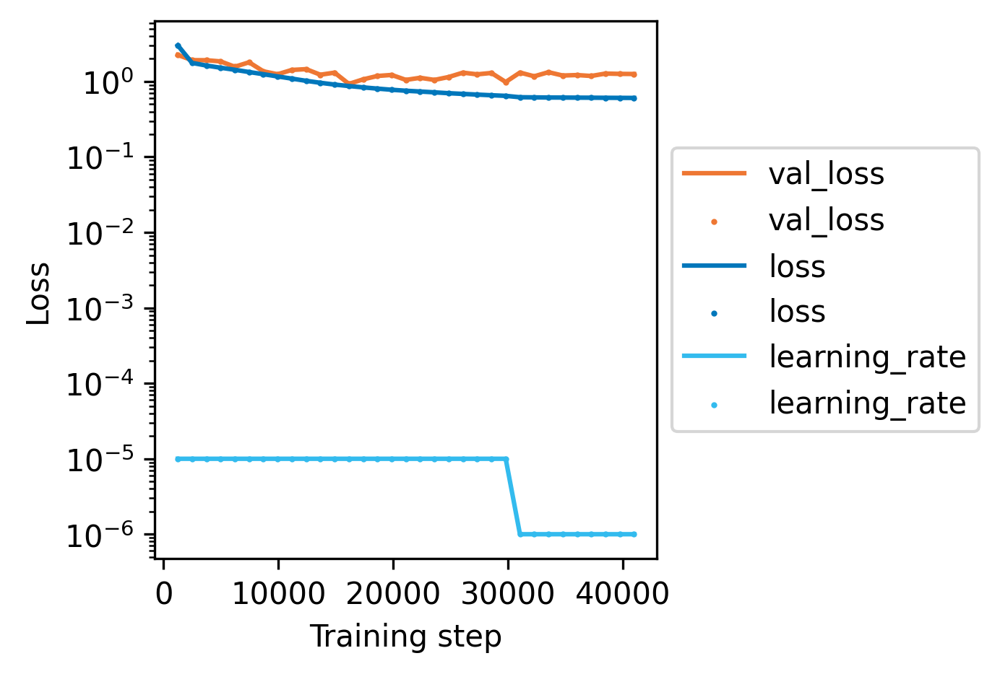
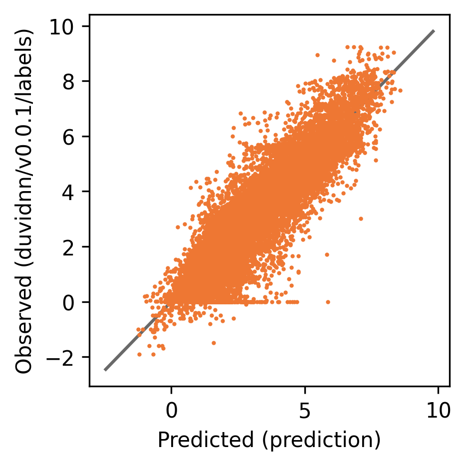
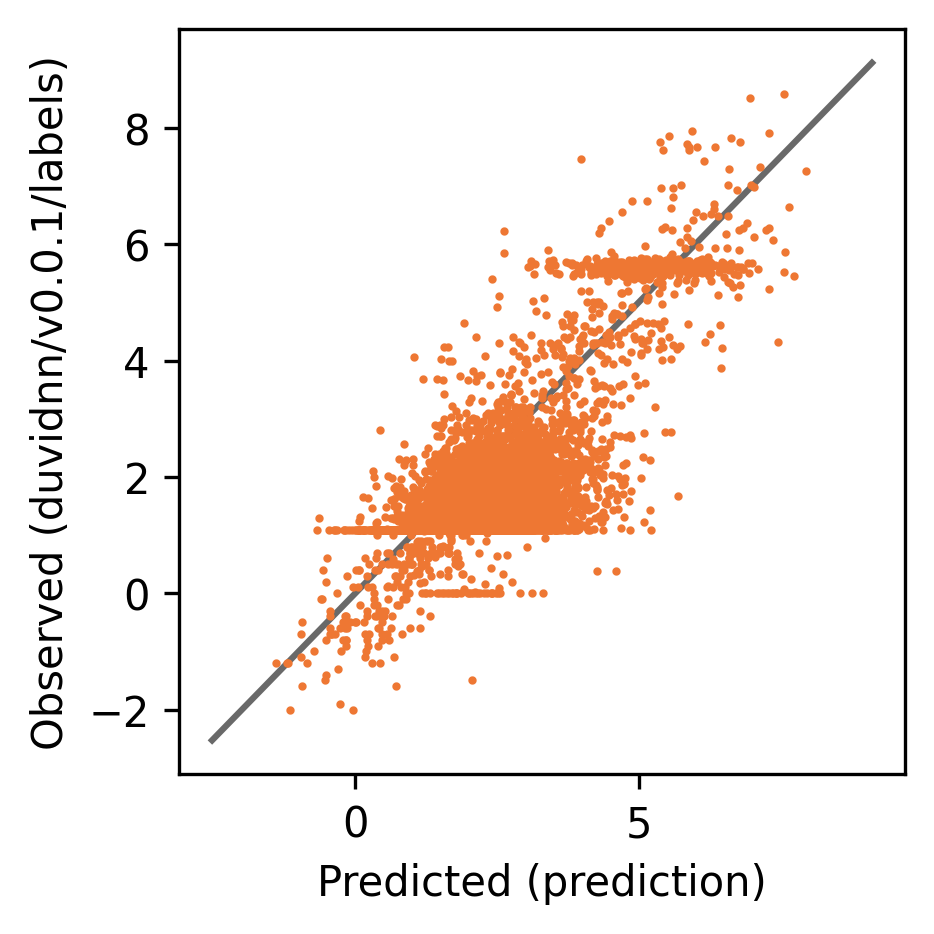
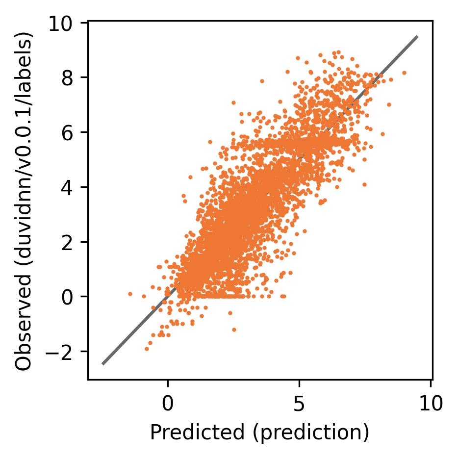

# OpenADMET-ExpansionRx Challenge entry

_Updated:_ Sun 18 Jan 20:38:30 GMT 2026

Trained on the OpenADMET-ExpansionRx Challenge dataset (28352 rows in total, [HF dataset](https://huggingface.co/datasets/openadmet/openadmet-expansionrx-challenge-train-data)).

## Model details

This model was trained using [our DuvidNN framework](https://github.com/scbirlab/duvidnn), 
as a result of hyperparameter searches and selecting the model that performs best on unseen test data 
(from a scaffold split). 

DuvidNN also saves the training data in this checkpoint to allows the calculation of uncertainty metrics 
based on that training data.

This model is the best regression model from a hyperparameter search, determined
by Pearson's _r_ on a held-out test set not seen in training or early stopping. 

### Model architecture

- **Regression**

```json

{
    "class_name": "bilinear-fp",
    "context": [
        "endpoint:hash"
    ],
    "dropout": 0.0,
    "ensemble_size": 3,
    "features": [
        [
            "clogp",
            "transformer://models/llm/lchemme-1:clean_smiles"
        ]
    ],
    "learning_rate": 1e-05,
    "merge_method": "product",
    "n_hidden": 1,
    "n_units": 128,
    "residual_depth": 2
}
```

### Model usage

You can use this model with:

```python
from duvida.autoclasses import AutoModelBox
modelbox = AutoModelBox.from_pretrained("hf://eachanjohnson/openadmet-2601")
modelbox.predict(data=..., inputs=[...], columns=[...])  # make predictions on your own data
```

## Training details

- **Dataset:** [OpenADMET-ExpansionRx Challenge](https://huggingface.co/datasets/openadmet/openadmet-expansionrx-challenge-train-data) (28352 rows in total)
- **Input column:** SMILES
- **Output column:** endpoint_value
- **Split type:** Murcko scaffold
- **Split proportions:** 
    - 70% training (19847 rows)
    - 15% validation (for early stopping) (4252 rows)
    - 15% test (for selecting hyperparameters) (4253 rows)

Here is the training log:



And these are the evaluation scores.

Train (19847 rows):

```json

{
    "pearson_r": 0.91119962136608,
    "rmse": 0.7748369574546814,
    "spearman_rho": 0.9035741221688703
}
```



Validation (4252 rows):

```json

{
    "pearson_r": 0.7913155721534122,
    "rmse": 1.093949794769287,
    "spearman_rho": 0.6601919453312246
}
```



Test (4253 rows):

```json

{
    "pearson_r": 0.8602896516281636,
    "rmse": 1.0420299768447876,
    "spearman_rho": 0.8559756780322346
}
```




### Data Collection and Processing

Data were processed using [schemist](https://github.com/scbirlab/schemist), a tool for processing chemical datasets.

The SMILES strings have been canonicalized, and split into training (70%), validation (15%), and test (15%) sets 
by Murcko scaffold for each species with more than 1000 entries. Additional features like molecular weight and 
topological polar surface area have also been calculated.
